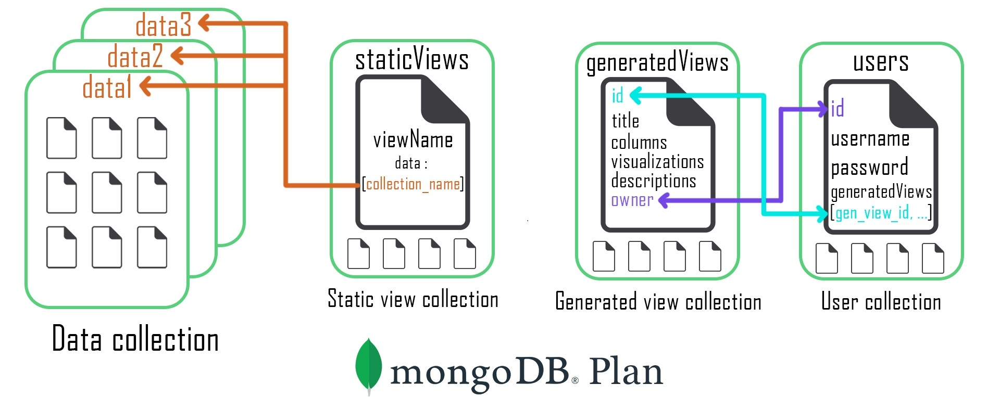
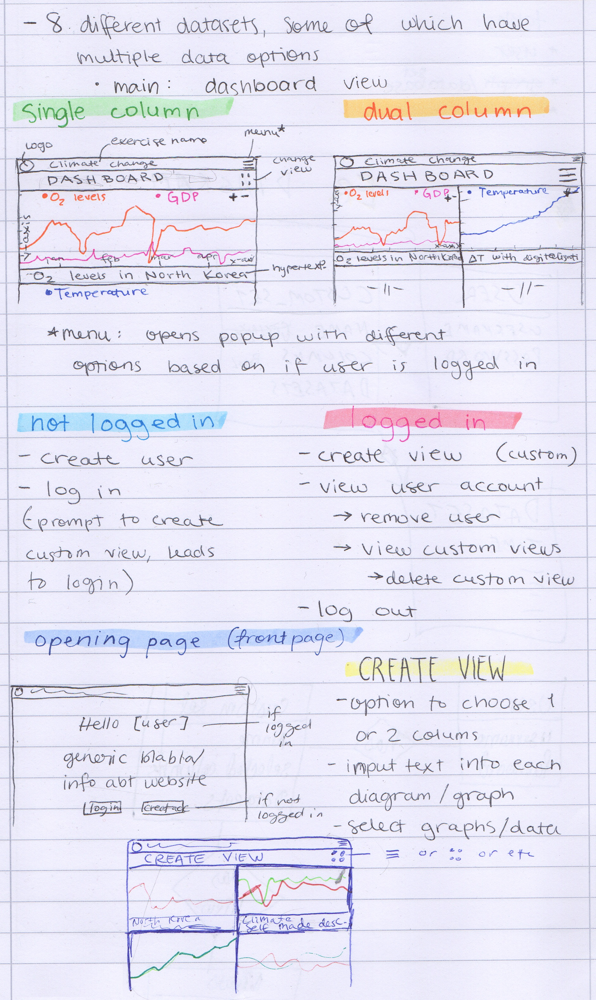

# Climate Change Visualizer
By Oskari Rantamaula, Vadims Lapins, Selina Kallio and Bishal Rai

## Introduction
A web application for visualizing climate change related data, including the state and progression of climate change related factors such as temperatures, atmospheric CO2, emission sources and related human activity. The project is based on an assignment which specified the data to be used along with a rough description of the application's desired features.
- Hosted app: https://ccv-react-app.herokuapp.com/
- Repositories: https://github.com/orgs/Ocean-s-777/repositories
- Kanban: https://github.com/orgs/Ocean-s-777/projects/1/views/1

## Team & Development
Together the team laid the plans for the project, Selina being primarily responsible for the UI design, and the rest focusing on choosing and learning the tools and technologies to be used. In the development stage Selina focused on the front-end, while Vadim and Oskari worked on getting the data from the initial .csv files and other formats first to the database and then all the way to the graphs displayed on screen. The MongoDB database was managed mainly by Vadim, while Oskari and Selina also had some part in parsing the data to be hosted there. Oskari took responsibility in receiving the data in the client and doing all the data visualization with JavaScript, React and Chart.js library, and thus also in planning with Vadim to make sure all the JSON data matched the requirements of both the front and backend of the application. Selina took care of basic React functionalities alongside detailing the UI and planning the user experience. In the early stages Bishal contributed by making some HTML elements and CSS styling, and later, more importantly, by performing functionality tests for different parts of the application. Finally, Vadim took care of the user authorization and authentication while Oskari focused on the UI scalability and Selina put finishing touches on the UI, including taking care of colors and descriptions of the visualizations.

The project was a great learning experience for everyone involved, as many of the tools used were completely or relatively new for the team members. A lot of learning happened with React.js, Chart.js, MongoDB and various authentication and authorization methods. The most notable experiences were, however, in learning more about the dynamics of group work in an IT project. This included agreeing upon communication conventions, the use of Kanban for process management, and refining some Git and GitHub practices in a teamwork context.

## Architecture & Deployment
The project consists of three parts: React.js front-end, Express.js server running on Node.js and a MongoDB database. Both the React app and the Express server are hosted in Heroku while the database is hosted in Digital Ocean.

The climate change related data used by the application was originally retrieved from various reputable sources (see the app for links), then parsed and saved to the database in JSON format. The frontend of the application communicates with the server to retrieve the data from the database and to store user created information, namely user account details and user created customized data visualization views.

Knowing that no secretive information was going to be used in the project, direct pipelines from repositories to Heroku were used. This meant that every pushed commit triggered an automatic build process to the deployment sites, allowing the team to constantly ensure that Heroku hosted versions worked similarly to locally hosted development versions.

MongoDB was chosen as the database for the project because of its document-oriented approach to data, meaning the data could be stored in flexible JSON-like documents instead of rigid tables used in traditional relational databases. This catered to the project's needs as the datasets to be used were not uniform in their layouts. A decision was made to create 2 collections that would handle all user and custom view CRUD operations and 1 collection that would establish relation with all graph-data containing collections. MongoDB Compass, a GUI for MongoDB, was used to import all the datasets into the database after they were parsed to suitable format with Excel and Regex scripts.

### As of 10.11.2023 database hosting was moved to MongoDB Atlas

## User Accounts & Custom Views
Users can register themselves on the application by providing a unique username and a sufficiently long password. This allows access to user specific homepage with “logout” and “delete account” features, and most importantly, the access to create their own custom views. These custom views can be composed of any graphs included in the application. The user can name their view, select the view to be displayed in either one or two columns and either write their own description texts for their chosen graphs or default to keeping the standard descriptions. A unique URL is created for every user created view, so the views can be easily shared with anyone regardless of if they are a registered user or not. All views created by a user are listed on the user's homepage and can be individually deleted if so wished. All of any given user’s custom views will also be automatically deleted if the corresponding user account is deleted.

Related technologies:
- Authorization: Passport middleware
- Password hashing: bcryptjs library
- Unique user ID's: uuid4 library
- Accessing and creating user specific content: JwtStrategy, LocalStrategy

## UI & UX
The goal for the user interface design was to provide an appropriate mood for the website. The colors blue and green were chosen to represent nature, the focal point of climate change. Fonts, icons and borders were chosen to provide an atmosphere of a professional clean-cut environment. An important matter was ensuring accessibility to people with difficulty seeing. This was achieved by choosing majorly different colors for the graphs and strong contrast between text and its background. The final deciding factor was working out element placement on low resolution screens; blocks needed to change places or completely disappear on mobile and tablet views.

The web app includes a responsive UI, meaning the contents will automatically resize appropriately when the browser window is resized. This is especially important for the graphs, as it makes sure they stay readable in different window sizes. The 2-column layouts that can be selected for custom views will automatically change to 1-column whenever it is required to keep the graphs clear and readable.

## How to install and use the application locally
It is possible to clone the GitHub repositories and then run a local version of both the client and the server, but a new database will have to be created to benefit from all the applications intended functionalities. For those interested, the repositories can both be found at https://github.com/orgs/Ocean-s-777/repositories.

After cloning the CCV_Node_server, you can run: `npm install` in its main directory to install the server’s dependencies, and then run either `npm run start` or `npm run dev` (to start with nodemon) to start the server. After cloning the CCV_React_app, you can run: `npm install` in its main directory to install the client’s dependencies, and then run `npm start` to start the client.
